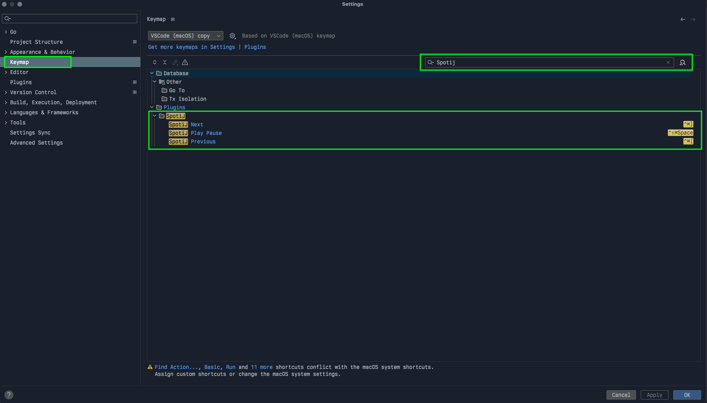

# SpotiJ

<!-- Plugin description -->

Simple spotify plugin for the Intellij suite of IDEs.

>  Currently only works with MacOS and Linux (dbus)

## Installation

Install through the JetBrains Market Place

## Usage

Go to Settings -> Keymap -> Search Spotij and configure shortcuts

<!-- Plugin description end -->

